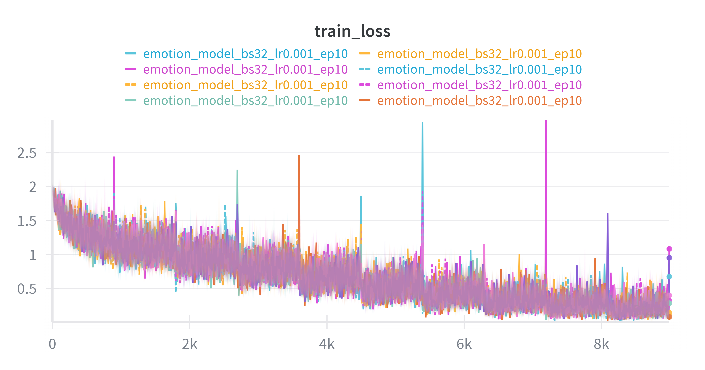
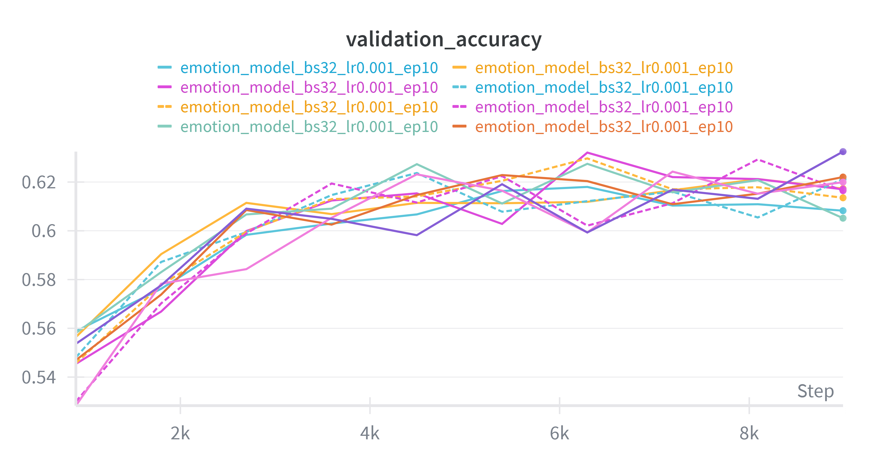
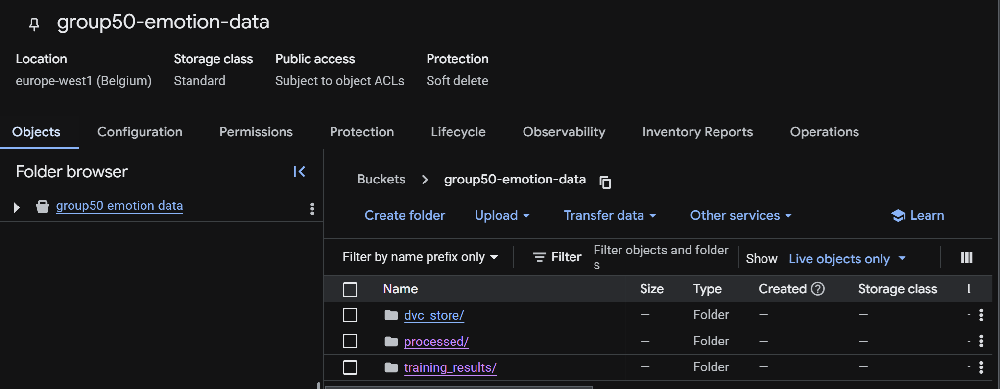
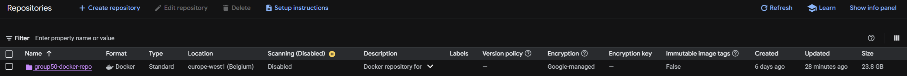
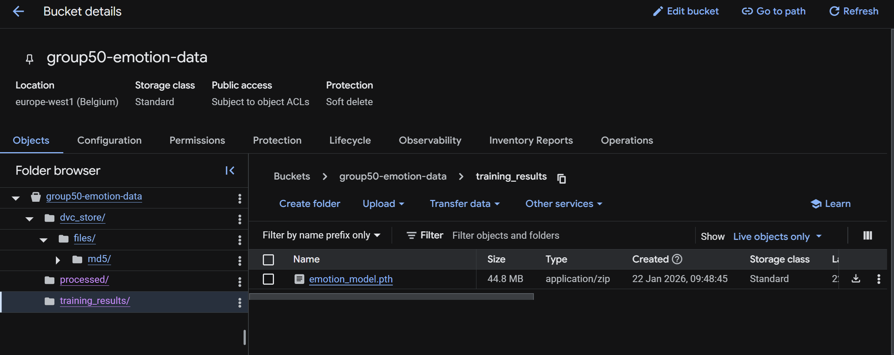
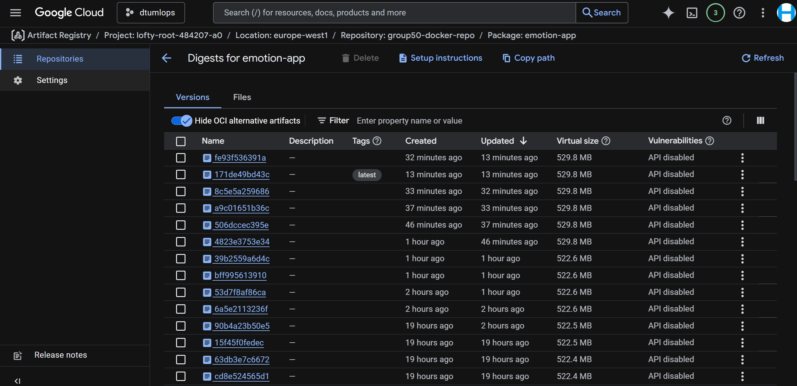
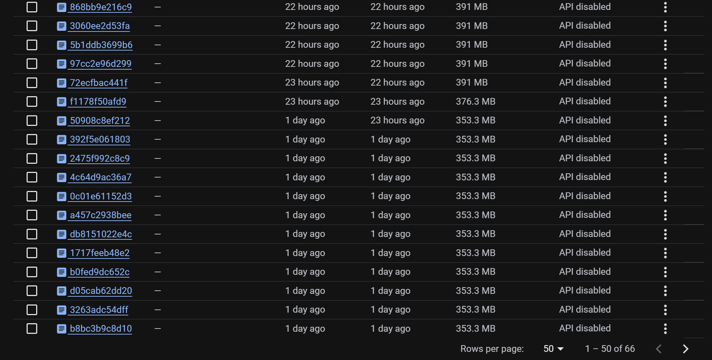
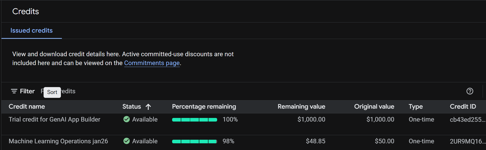
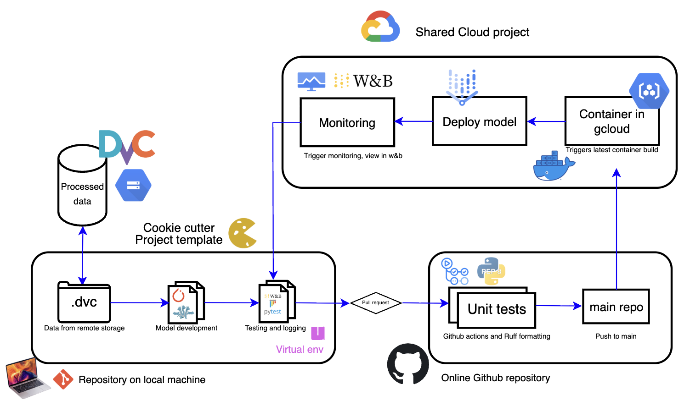

# Exam template for 02476 Machine Learning Operations

This is the report template for the exam. Please only remove the text formatted as with three dashes in front and behind
like:

```--- question 1 fill here ---```

Where you instead should add your answers. Any other changes may have unwanted consequences when your report is
auto-generated at the end of the course. For questions where you are asked to include images, start by adding the image
to the `figures` subfolder (please only use `.png`, `.jpg` or `.jpeg`) and then add the following code in your answer:

``

In addition to this markdown file, we also provide the `report.py` script that provides two utility functions:

Running:

```bash
python report.py html
```

Will generate a `.html` page of your report. After the deadline for answering this template, we will auto-scrape
everything in this `reports` folder and then use this utility to generate a `.html` page that will be your serve
as your final hand-in.

Running

```bash
python report.py check
```

Will check your answers in this template against the constraints listed for each question e.g. is your answer too
short, too long, or have you included an image when asked. For both functions to work you mustn't rename anything.
The script has two dependencies that can be installed with

```bash
pip install typer markdown
```

or

```bash
uv add typer markdown
```

## Overall project checklist

The checklist is *exhaustive* which means that it includes everything that you could do on the project included in the
curriculum in this course. Therefore, we do not expect at all that you have checked all boxes at the end of the project.
The parenthesis at the end indicates what module the bullet point is related to. Please be honest in your answers, we
will check the repositories and the code to verify your answers.

### Week 1

* [X] Create a git repository (M5)
* [X] Make sure that all team members have write access to the GitHub repository (M5)
* [X] Create a dedicated environment for you project to keep track of your packages (M2)
* [X] Create the initial file structure using cookiecutter with an appropriate template (M6)
* [X] Fill out the `data.py` file such that it downloads whatever data you need and preprocesses it (if necessary) (M6)
* [X] Add a model to `model.py` and a training procedure to `train.py` and get that running (M6)
* [X] Remember to fill out the `requirements.txt` and `requirements_dev.txt` file with whatever dependencies that you
    are using (M2+M6)
* [X] Remember to comply with good coding practices (`pep8`) while doing the project (M7)
* [X] Do a bit of code typing and remember to document essential parts of your code (M7)
* [ ] Setup version control for your data or part of your data (M8)
* [X] Add command line interfaces and project commands to your code where it makes sense (M9)
* [X] Construct one or multiple docker files for your code (M10)
* [X] Build the docker files locally and make sure they work as intended (M10)
* [X] Write one or multiple configurations files for your experiments (M11)
* [X] Used Hydra to load the configurations and manage your hyperparameters (M11)
* [ ] Use profiling to optimize your code (M12)
* [X] Use logging to log important events in your code (M14)
* [X] Use Weights & Biases to log training progress and other important metrics/artifacts in your code (M14)
* [X] Consider running a hyperparameter optimization sweep (M14)
* [ ] Use PyTorch-lightning (if applicable) to reduce the amount of boilerplate in your code (M15)

### Week 2

* [X] Write unit tests related to the data part of your code (M16)
* [X] Write unit tests related to model construction and or model training (M16)
* [X] Calculate the code coverage (M16)
* [X] Get some continuous integration running on the GitHub repository (M17)
* [X] Add caching and multi-os/python/pytorch testing to your continuous integration (M17)
* [X] Add a linting step to your continuous integration (M17)
* [X] Add pre-commit hooks to your version control setup (M18)
* [X] Add a continues workflow that triggers when data changes (M19)
* [X] Add a continues workflow that triggers when changes to the model registry is made (M19)
* [X] Create a data storage in GCP Bucket for your data and link this with your data version control setup (M21)
* [X] Create a trigger workflow for automatically building your docker images (M21)
* [X] Get your model training in GCP using either the Engine or Vertex AI (M21)
* [X] Create a FastAPI application that can do inference using your model (M22)
* [X] Deploy your model in GCP using either Functions or Run as the backend (M23)
* [X] Write API tests for your application and setup continues integration for these (M24)
* [X] Load test your application (M24)
* [ ] Create a more specialized ML-deployment API using either ONNX or BentoML, or both (M25)
* [ ] Create a frontend for your API (M26)

### Week 3

* [X] Check how robust your model is towards data drifting (M27)
* [X] Deploy to the cloud a drift detection API (M27)
* [ ] Instrument your API with a couple of system metrics (M28)
* [ ] Setup cloud monitoring of your instrumented application (M28)
* [ ] Create one or more alert systems in GCP to alert you if your app is not behaving correctly (M28)
* [X] If applicable, optimize the performance of your data loading using distributed data loading (M29)
* [ ] If applicable, optimize the performance of your training pipeline by using distributed training (M30)
* [ ] Play around with quantization, compilation and pruning for you trained models to increase inference speed (M31)

### Extra

* [X] Write some documentation for your application (M32)
* [X] Publish the documentation to GitHub Pages (M32)
* [ ] Revisit your initial project description. Did the project turn out as you wanted?
* [X] Create an architectural diagram over your MLOps pipeline
* [ ] Make sure all group members have an understanding about all parts of the project
* [ ] Uploaded all your code to GitHub

## Group information

### Question 1
> **Enter the group number you signed up on <learn.inside.dtu.dk>**
>
> Answer:

50

### Question 2
> **Enter the study number for each member in the group**
>
> Answer:

s224081, s225787, s210666, s224215, s210659

### Question 3
> **A requirement to the project is that you include a third-party package not covered in the course. What framework**
> **did you choose to work with and did it help you complete the project?**
>
> Recommended answer length: 100-200 words.
>
> Example:
> *We used the third-party framework ... in our project. We used functionality ... and functionality ... from the*
> *package to do ... and ... in our project*.
>
> Answer:

We used the TIMM library as a third-party package in our project, as it provides a wide range of pre-trained models and architectures for image classification tasks. Espeically, we used the ResNet18 model. It is described as one of the smallest and most lightweight models, hence, making it a popular choice. By using the pre-trained weights from TIMM, we were able to speed up our general development process.


## Coding environment

> In the following section we are interested in learning more about you local development environment. This includes
> how you managed dependencies, the structure of your code and how you managed code quality.


### Question 4

> **Explain how you managed dependencies in your project? Explain the process a new team member would have to go**
> **through to get an exact copy of your environment.**
>
> Recommended answer length: 100-200 words
>
> Example:
> *We used ... for managing our dependencies. The list of dependencies was auto-generated using ... . To get a*
> *complete copy of our development environment, one would have to run the following commands*
>
> Answer:

We used UV for managing environments, and all of our dependencies are in the and a `pyproject.toml` file which manages our packages. In the beginning, we linked the `pyproject.toml` file to a requirements.txt file for easier installation of dependencies, but later, we had to restrict ourselves to only using the `pyproject.toml` file due to issues with .dvc when used together with `requirements.txt`.

Furthermore, we used Cookiecutter to create the initial project structure. To uphold the PEP8 standard we used Ruff for linting formatting.

If a new team member were to join (assuming they already cloned the repository), all they have to do is, first, ensure they have UV installed on their computer, then from the main repository they have to do ```cd MLOps_project``` to get into the project folder, and then run one of the following commands according to their hardware setup:

CPU:
```bash
uv sync --extra cpu --index pytorch-cpu
```

CUDA (NVIDIA GPUs):

```bash
uv sync --extra cuda --index pytorch-cuda
```

MPS (Apple Silicon GPUs):

```bash
uv sync --extra mps --index pytorch-mps
```

### Question 5

> **We expect that you initialized your project using the cookiecutter template. Explain the overall structure of your**
> **code. What did you fill out? Did you deviate from the template in some way?**
>
> Recommended answer length: 100-200 words
>
> Example:
> *From the cookiecutter template we have filled out the ... , ... and ... folder. We have removed the ... folder*
> *because we did not use any ... in our project. We have added an ... folder that contains ... for running our*
> *experiments.*
>
> Answer:

From the cookiecutter template, we have filled out the `data.py`, `models.py`, `train.py`, and `api.py` files in the `src/project_name/` folder, and we filled out all python test files under the `tests/` folder. Though, we deleted the `visualize.py` file, since all visualization was done in w&b and gcloud monitoring.

We have also added configuration files in the `configs/` folder to manage our hyperparameters and experiment settings along with a new `api/` folder in the main directory to contain the API code for deployment as well as data drift detection.

Moreover, we later made two versions of the `train.py`file. The one keeping the original name implements w&b logging and sweeping, meanwhile the other named `train_hydra_ver.py` implements hydra configs and w&b logging - this was required since hyperparameter sweeping along with hydra gave conflicts.

### Question 6

> **Did you implement any rules for code quality and format? What about typing and documentation? Additionally,**
> **explain with your own words why these concepts matters in larger projects.**
>
> Recommended answer length: 100-200 words.
>
> Example:
> *We used ... for linting and ... for formatting. We also used ... for typing and ... for documentation. These*
> *concepts are important in larger projects because ... . For example, typing ...*
>
> Answer:

For code quality and format, we went for PEP8 standards using Ruff for linting and formatting. These formatting steps were required before mergning a pull request with the main repository, as unit tests were created to see, if code followed the required standards. If not, the unit tests on Github actions would fail.

[TO DO: svar på det der med typing and documention? måsk? idk...]

Generally, such rules for code quality are important for larger projects, since they help ensure a baseline for the code quality, making it easier for other team members to read and understand each other's code. The code for the entire project will become more uniform, which makes it easier to maintain and extend in the future. In addition to all of this, having proper documentation becomes a benefit for new members, as they can easily understand the purpose and functionality of different parts of the codebase.

## Version control

> In the following section we are interested in how version control was used in your project during development to
> corporate and increase the quality of your code.

Each group member made their own branch to work on different parts of the project. We used pull requests to merge code into the main branch after review.

### Question 7

> **How many tests did you implement and what are they testing in your code?**
>
> Recommended answer length: 50-100 words.
>
> Example:
> *In total we have implemented X tests. Primarily we are testing ... and ... as these the most critical parts of our*
> *application but also ... .*
>
> Answer:

We implemented 4 Pytests testing the code (api, data, training and model structure), for instance, the training test file would use the training function defined in `train.py` and with a set of hydra configs specifically for testing in `config/testings/`, then `test_training.py` would call a test version of the model named `emotion_test.pth` and assert if the loss is decreasing. This is useful, as `emotion_test.pth` could further be used for testing the evaluation script (`evaluate.py`). So, instead of feeding a fully trained model on numerous epochs, we could use a simple model on only 2 epochs for running tests.

### Question 8

> **What is the total code coverage (in percentage) of your code? If your code had a code coverage of 100% (or close**
> **to), would you still trust it to be error free? Explain you reasoning.**
>
> Recommended answer length: 100-200 words.
>
> Example:
> *The total code coverage of code is X%, which includes all our source code. We are far from 100% coverage of our **
> *code and even if we were then...*
>
> Answer:

We ran ```uv run coverage run -m pytest tests/``` with tests covering the data, model and training parts of the source code. The data tests covered 16% of the code, model tests covered 83% of the code and training tests covered 100% of the code. The code coverage is far from 100% for our data tests, but coverage for the other tests are high. However, even if we were to reach 100% coverage for all tests, we would not trust the code to be completely error free. Because a 100% coverage only ensures that the code can run, but it does not guarantee that the code is logically correct for different cases (especially edge cases).

While 100% coverage tests is a good indicator for code quality and helps reduce uncertainty, it does not eliminate it.

### Question 9

> **Did your workflow include using branches and pull requests? If yes, explain how. If not, explain how branches and**
> **pull request can help improve version control.**
>
> Recommended answer length: 100-200 words.
>
> Example:
> *We made use of both branches and PRs in our project. In our group, each member had an branch that they worked on in*
> *addition to the main branch. To merge code we ...*
>
> Answer:

The first thing we did when joining a shared Git repository was to create a branch for each teammember resulting in 5 branches (excluding main). The general workflow was that each member worked on their own branch and when they wanted to merge code into the main branch, they created a pull request. The pull request was then reviewed by at least another member before being approved and it had to undergo unit tests via Github actions, and if approved, it would be merged into the main branch. This process helped both code quality, version control and preventing merge conflicts.

### Question 10

> **Did you use DVC for managing data in your project? If yes, then how did it improve your project to have version**
> **control of your data. If no, explain a case where it would be beneficial to have version control of your data.**
>
> Recommended answer length: 100-200 words.
>
> Example:
> *We did make use of DVC in the following way: ... . In the end it helped us in ... for controlling ... part of our*
> *pipeline*
>
> Answer:

--- question 10 fill here ---

> Yes, we used `DVC` (Data Version Control) to manage our large image datasets. Instead of storing the `.pt` files in Git, which would make the repository too large, DVC created small `.dvc` metadata files. These files contain hashes (pointers) to the actual data stored in our `GCP Bucket`. This allowed us to version our data alongside our code, ensuring that every model version is linked to the exact dataset version used to train it.

### Question 11

> **Discuss you continuous integration setup. What kind of continuous integration are you running (unittesting,**
> **linting, etc.)? Do you test multiple operating systems, Python  version etc. Do you make use of caching? Feel free**
> **to insert a link to one of your GitHub actions workflow.**
>
> Recommended answer length: 200-300 words.
>
> Example:
> *We have organized our continuous integration into 3 separate files: one for doing ..., one for running ... testing*
> *and one for running ... . In particular for our ..., we used ... .An example of a triggered workflow can be seen*
> *here: <weblink>*
>
> Answer:

[TO DO: mattias du kan cooke her I believe]

## Running code and tracking experiments

> In the following section we are interested in learning more about the experimental setup for running your code and
> especially the reproducibility of your experiments.

### Question 12

> **How did you configure experiments? Did you make use of config files? Explain with coding examples of how you would**
> **run a experiment.**
>
> Recommended answer length: 50-100 words.
>
> Example:
> *We used a simple argparser, that worked in the following way: Python  my_script.py --lr 1e-3 --batch_size 25*
>
> Answer:

> We used Hydra for configuration management. We mainly focused on configs for the trianing setup, as we saw ourselves testing training procuderes the most. Therefore, `.yaml` files for `training.py` were created in the `configs/` folder. Inside this file, we could choose the parameters for training such as learning rate, batch size, and number of epochs. With different `.yaml` files, we could have numerous training setups, some for large model runs, others for smaller runs. To run an experiment with specific hyperparameters, we would use the following command:

```
uv run train
```

This use use a default set of configs, and we could also choose specifc settings (for instance, `ex1_conf.yaml`) by running:

```
uv run train --config-name ex1_conf
```

Following training, the used configurations and the logs were automatically saved in the `outputs/` folder for future reference.

### Question 13

> **Reproducibility of experiments are important. Related to the last question, how did you secure that no information**
> **is lost when running experiments and that your experiments are reproducible?**
>
> Recommended answer length: 100-200 words.
>
> Example:
> *We made use of config files. Whenever an experiment is run the following happens: ... . To reproduce an experiment*
> *one would have to do ...*
>
> Answer:

> As mentioned in the question above, we used Hydra for configuration management. Whenever an experiment is run, the configuration file used for that specific experiment is saved in the `outputs/` folder along with the logs and results. This ensures that all the hyperparameters and settings used during the experiment are recorded and can be referenced later.

### Question 14

> **Upload 1 to 3 screenshots that show the experiments that you have done in W&B (or another experiment tracking**
> **service of your choice). This may include loss graphs, logged images, hyperparameter sweeps etc. You can take**
> **inspiration from [this figure](figures/wandb.png). Explain what metrics you are tracking and why they are**
> **important.**
>
> Recommended answer length: 200-300 words + 1 to 3 screenshots.
>
> Example:
> *As seen in the first image when have tracked ... and ... which both inform us about ... in our experiments.*
> *As seen in the second image we are also tracking ... and ...*
>
> Answer:

We have picked three screenshots below from our W&B dashboard. Firstly the [loss chart below](figures/loss_chart.png):



This image shows the loss over a training process through 10 epochs for different runs, all with same set of configs as depicted at the top of the image. Next is the [image of hyperparameter sweeps](figures/sweep.png):


The image shows optimal choices of parameter values for learning rate, batch size and epochs for which will give the lowest validation loss (as depicted by the color bar). Finally, we have an image over [validation](figures/val_chart.png) below:



These were for the same model runs for the loss chart, but this time, we see validation accuracy again over 10 epochs for all models (and the other configs are the same as well).


### Question 15

> **Docker is an important tool for creating containerized applications. Explain how you used docker in your**
> **experiments/project? Include how you would run your docker images and include a link to one of your docker files.**
>
> Recommended answer length: 100-200 words.
>
> Example:
> *For our project we developed several images: one for training, inference and deployment. For example to run the*
> *training docker image: `docker run trainer:latest lr=1e-3 batch_size=64`. Link to docker file: <weblink>*
>
> Answer:

> Docker was central to our project's reproducibility. We created a Dockerfile that defined our environment, including the Python version and all dependencies from our `pyproject.toml`. We used this to build a unified image for both training and inference. To run the inference image locally for testing, we used: `docker run -p 8000:8000 europe-west1-docker.pkg.dev/lofty-root-484207-a0/group50-docker-repo/emotion-app:latest`.

### Question 16

> **When running into bugs while trying to run your experiments, how did you perform debugging? Additionally, did you**
> **try to profile your code or do you think it is already perfect?**
>
> Recommended answer length: 100-200 words.
>
> Example:
> *Debugging method was dependent on group member. Some just used ... and others used ... . We did a single profiling*
> *run of our main code at some point that showed ...*
>
> Answer:

[TO DO: someone else GO :)]

## Working in the cloud

> In the following section we would like to know more about your experience when developing in the cloud.

### Question 17

> **List all the GCP services that you made use of in your project and shortly explain what each service does?**
>
> Recommended answer length: 50-200 words.
>
> Answer: We used the following four primary GCP services:

> `Cloud Storage:` Acted as our data lake and model registry, storing our versioned datasets (.pt tensors) and trained model checkpoints (.pth files).
> `Artifact Registry:` A central repository where we stored and managed our Docker container images for both training and inference.

> `Vertex AI:` Used for serverless custom training jobs. It provisioned the necessary compute resources to run our training script at scale without us managing the underlying VMs.

> `Cloud Run:` A fully managed platform where we deployed our FastAPI inference service as a container, allowing it to auto-scale based on incoming request traffic.

### Question 18

> **The backbone of GCP is the Compute engine. Explained how you made use of this service and what type of VMs**
> **you used?**
>
> Recommended answer length: 100-200 words.
>
> Example:
> *We used the compute engine to run our ... . We used instances with the following hardware: ... and we started the*
> *using a custom container: ...*
>
> Answer:

> While we used `Vertex AI` for training, it utilizes Compute Engine infrastructure under the hood. For our training jobs, we used n1-standard-4 machine types. These VMs provide a balanced mix of 4 vCPUs and 15 GB of memory, which was sufficient for our ResNet18 emotion classification model. We opted for these because they are optimized for general-purpose workloads and are cost-effective for the scale of our dataset.


### Question 19

> **Insert 1-2 images of your GCP bucket, such that we can see what data you have stored in it.**
> **You can take inspiration from [this figure](figures/bucket.png).**
>
> Answer:
>


### Question 20

> **Upload 1-2 images of your GCP artifact registry, such that we can see the different docker images that you have**
> **stored. You can take inspiration from [this figure](figures/registry.png).**
>
> Answer:





### Question 21

> **Upload 1-2 images of your GCP cloud build history, so we can see the history of the images that have been build in**
> **your project. You can take inspiration from [this figure](figures/build.png).**
>
> Answer:





### Question 22

> **Did you manage to train your model in the cloud using either the Engine or Vertex AI? If yes, explain how you did**
> **it. If not, describe why.**
>
> Recommended answer length: 100-200 words.
>
> Example:
> *We managed to train our model in the cloud using the Engine. We did this by ... . The reason we choose the Engine*
> *was because ...*
>
> Answer:
>
> Yes, we successfully trained our model using Vertex AI Custom Jobs. We containerized our training application with Docker and pushed it to the Artifact Registry. We then used the `gcloud ai custom-jobs create` command to launch the job in the `europe-west1` region. Vertex AI automatically provisioned an `n1-standard-4` VM, mounted our GCS bucket via GCS FUSE so the script could read the training data, and executed the training. After completion, the model was saved back to our GCS bucket. 

## Deployment

### Question 23

> **Did you manage to write an API for your model? If yes, explain how you did it and if you did anything special. If**
> **not, explain how you would do it.**
>
> Recommended answer length: 100-200 words.
>
> Example:
> *We did manage to write an API for our model. We used FastAPI to do this. We did this by ... . We also added ...*
> *to the API to make it more ...*
>
> Answer:

Yes, we wrote a simple API "app" for our model using FastAPI, which has located in `api/main.py`. The app exposes an endpoint `/predict` that accepts POST requests with input data for making predictions. We used the `uvicorn` server to run the FastAPI application locally for testing purposes first. What the app does is that it loads a pre-trained version of our emotion model, then a user can upload an image with a facial expression, and the app will return the predicted emotion along with a score on how confident the model is. Of course, the emotions that the model can predict are limited to the labels that is it trained on.

### Question 24

> **Did you manage to deploy your API, either in locally or cloud? If not, describe why. If yes, describe how and**
> **preferably how you invoke your deployed service?**
>
> Recommended answer length: 100-200 words.
>
> Example:
> *For deployment we wrapped our model into application using ... . We first tried locally serving the model, which*
> *worked. Afterwards we deployed it in the cloud, using ... . To invoke the service an user would call*
> *`curl -X POST -F "file=@file.json"<weburl>`*
>
> Answer:

> We successfully deployed our `FastAPI` application to `Cloud Run` for a serverless production environment. To ensure the service was reachable for testing, we enabled unauthenticated invocations by granting the Cloud Run Invoker role to allUsers. The API is publicly accessible at: `https://simple-emotion-gcp-app-826382891728.europe-west1.run.app`. To manage costs, we configured the service with strict scaling limits, including a maximum of 1 concurrent request per instance.

### Question 25

> **Did you perform any unit testing and load testing of your API? If yes, explain how you did it and what results for**
> **the load testing did you get. If not, explain how you would do it.**
>
> Recommended answer length: 100-200 words.
>
> Example:
> *For unit testing we used ... and for load testing we used ... . The results of the load testing showed that ...*
> *before the service crashed.*
>
> Answer:

[TO DO: actually make api unit testing? and then describe it]

### Question 26

> **Did you manage to implement monitoring of your deployed model? If yes, explain how it works. If not, explain how**
> **monitoring would help the longevity of your application.**
>
> Recommended answer length: 100-200 words.
>
> Example:
> *We did not manage to implement monitoring. We would like to have monitoring implemented such that over time we could*
> *measure ... and ... that would inform us about this ... behaviour of our application.*
>
> Answer:

[TO DO: idk]

## Overall discussion of project

> In the following section we would like you to think about the general structure of your project.

### Question 27

> **How many credits did you end up using during the project and what service was most expensive? In general what do**
> **you think about working in the cloud?**
>
> Recommended answer length: 100-200 words.
>
> Example:
> *Group member 1 used ..., Group member 2 used ..., in total ... credits was spend during development. The service*
> *costing the most was ... due to ... . Working in the cloud was ...*
>
> Answer:

> Group member Henrik: During the project, I was the primary user of the group's cloud resources. We started with a $50.00 credit allocation, and by the end of the project, $48.85 remained, meaning we spent a total of $1.15.

> The most expensive service was `Vertex AI` (Compute Engine). This was due to the multiple training iterations (v1 through v13) we performed on `n1-standard-4` virtual machines to resolve pathing and checkpointing issues. While Cloud Storage hosted our large processed tensors and model registry, its cost was negligible compared to the active compute time required for model training.

> In general, working in the cloud was a highly positive but steep learning curve. The ability to provision high-performance hardware on demand and share data instantly with group members via `GCS buckets` was invaluable for our collaboration. However, the complexity of `IAM` permissions and the initial difficulty of debugging "hidden" containerized environments reminded us that cloud development requires much more meticulous environment configuration than local development.



### Question 28

> **Did you implement anything extra in your project that is not covered by other questions? Maybe you implemented**
> **a frontend for your API, use extra version control features, a drift detection service, a kubernetes cluster etc.**
> **If yes, explain what you did and why.**
>
> Recommended answer length: 0-200 words.
>
> Example:
> *We implemented a frontend for our API. We did this because we wanted to show the user ... . The frontend was*
> *implemented using ...*
>
> Answer:

[TO DO: :0]

### Question 29

> **Include a figure that describes the overall architecture of your system and what services that you make use of.**
> **You can take inspiration from [this figure](figures/overview.png). Additionally, in your own words, explain the**
> **overall steps in figure.**
>
> Recommended answer length: 200-400 words
>
> Example:
>
> *The starting point of the diagram is our local setup, where we integrated ... and ... and ... into our code.*
> *Whenever we commit code and push to GitHub, it auto triggers ... and ... . From there the diagram shows ...*
>
> Answer:



The starting point of the diagram is the setup on our local machine which all happens inside our own git repository. Here, we have integrated both .dvc for pulling data from gcp cloud storage (instead of having thousands of images locally on each member's computer), we have UV for package managing, and then we have the overall cookie cutter project structure. Inside this, we implemented all necessary code for data loading, model definition, training and evaluation and testing - everything needed to run and test our machine learning model. Then, whenever we are ready, we commit the changes to a local branch, which sends a pull request to the main git. Here, everything undergoes unit testing and linting before being merged into the main branch.

When a merge into the main branch happens, it triggers a cloud build in the gcp with our docker container. Then with a built container, we can run models on the cloud and start monitoring. Monitoring is triggered in gcloud but is sent to W&B for visualization and logging of the model run.

### Question 30

> **Discuss the overall struggles of the project. Where did you spend most time and what did you do to overcome these**
> **challenges?**
>
> Recommended answer length: 200-400 words.
>
> Example:
> *The biggest challenges in the project was using ... tool to do ... . The reason for this was ...*
>
> Answer:

[TO DO: write a good answer here.]

### Question 31

> **State the individual contributions of each team member. This is required information from DTU, because we need to**
> **make sure all members contributed actively to the project. Additionally, state if/how you have used generative AI**
> **tools in your project.**
>
> Recommended answer length: 50-300 words.
>
> Example:
> *Student sXXXXXX was in charge of developing of setting up the initial cookie cutter project and developing of the*
> *docker containers for training our applications.*
> *Student sXXXXXX was in charge of training our models in the cloud and deploying them afterwards.*
> *All members contributed to code by...*
> *We have used ChatGPT to help debug our code. Additionally, we used GitHub Copilot to help write some of our code.*
> Answer:

[TO DO: write contributions here]
